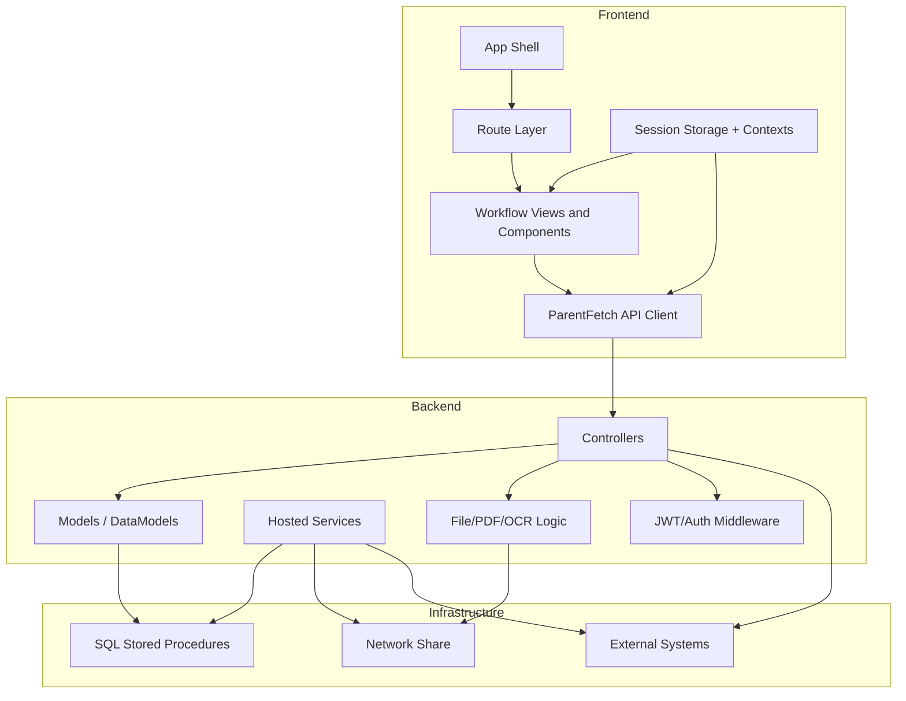
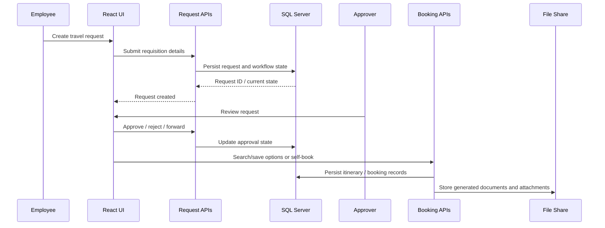
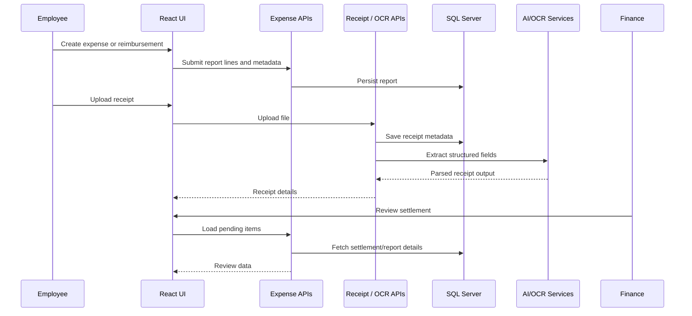
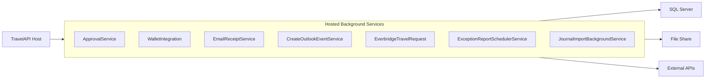
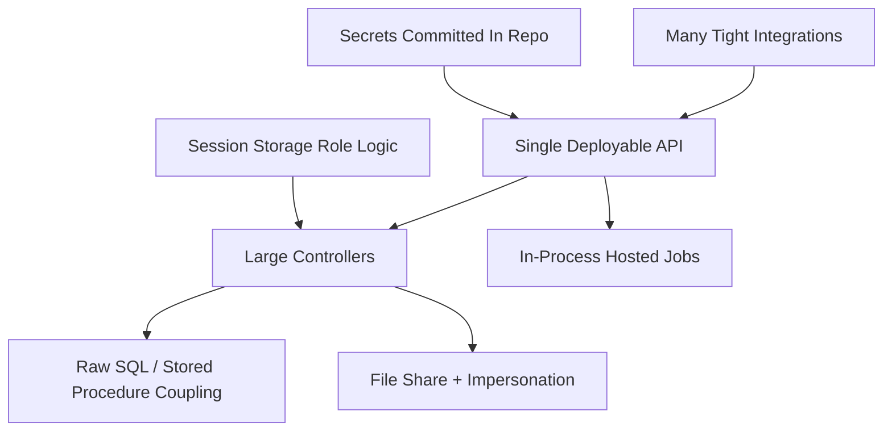

# TMS Internal Architecture Diagrams

## System Context

```mermaid
flowchart LR
    employee["Employee / Requester"]
    approver["Approver / Manager"]
    finance["Finance Team"]
    vendor["Travel Vendor / Agent"]
    admin["Admin"]

    web["Travel React SPA"]
    api["TravelAPI (.NET 6)"]
    db["MIS SQL Server"]
    files["DFS / File Share"]
    reports["Report Server"]

    aad["Azure AD / MSAL"]
    graph["Microsoft Graph"]
    travelVendor["Travel Vendor APIs"]
    concur["Concur"]
    everbridge["Everbridge"]
    fusion["Fusion / Apigee"]
    ai["Azure OpenAI / Bedrock / Textract"]

    employee --> web
    approver --> web
    finance --> web
    vendor --> web
    admin --> web

    web --> aad
    web --> api

    api --> db
    api --> files
    api --> reports
    api --> graph
    api --> travelVendor
    api --> concur
    api --> everbridge
    api --> fusion
    api --> ai
```

## Container View



## Travel Request To Booking Flow



## Expense And Receipt Flow



## In-Process Automation View



## Architectural Smell Map


