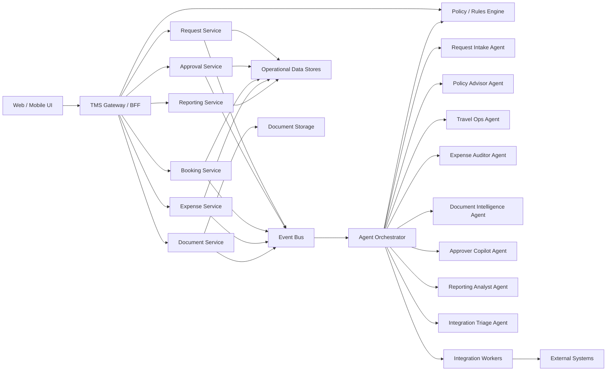

# TMS Internal Agentic Redesign Blueprint

Related documents:

- [Application Blueprint](APPLICATION_BLUEPRINT.md)
- [Data And Context Engineering Design](DATA_AND_CONTEXT_ENGINEERING.md)
- [Agent Skills](SKILLS.md)

## 1. Recommendation: Should TMS Become Agentic?

Yes, but only selectively.

TMS should not become a fully agent-driven transactional system where autonomous agents directly own core workflow state changes such as approvals, booking confirmation, reimbursement posting, or settlement closure. Those actions are high-risk, auditable, policy-bound, and should remain deterministic.

The right redesign is a hybrid platform:

- deterministic workflow services own records, state transitions, validations, approvals, postings, and audit history
- agentic components sit above and beside those services to perform interpretation, coordination, exception triage, recommendation, document understanding, and operator assistance

This recommendation is grounded in the current codebase:

- the existing system already mixes many workflows and integrations in one runtime
- a large portion of the real business logic appears to live in SQL procedures and hard-coded action strings
- security and auditability are weak today, so replacing deterministic control with unconstrained autonomy would increase risk
- however, the system clearly has many judgment-heavy tasks where agents can materially reduce manual work

The redesign goal should therefore be:

`Agentic assistance and orchestration around deterministic business services, not agentic ownership of financial or compliance-critical state.`

## 2. Where Agentic Behavior Adds Real Value

Agents are a good fit for the current TMS pain points in these areas:

- request intake interpretation and data normalization
- policy guidance and pre-submission coaching
- exception triage and routing
- receipt and document understanding
- supplier/vendor coordination support
- finance reconciliation assistance
- operations queue prioritization
- employee and approver copilots
- reporting narrative generation and anomaly explanation

Agents are a poor fit for direct ownership of:

- final approval decisions without human or rules-engine confirmation
- journal posting and financial settlement writes
- irreversible booking commits without deterministic checks
- policy enforcement that must be explainable, versioned, and testable

## 3. Design Principles

### 3.1 Core platform principles

- all authoritative workflow state lives in deterministic domain services
- every agent action must be explainable, attributable, and replayable
- every agent write must go through a typed tool/API boundary
- agents may recommend, draft, classify, summarize, and coordinate
- only specific trusted agents may execute side effects, and only through policy-gated tools

### 3.2 Autonomy principles

Use four autonomy levels:

- `L0 View`
  read-only summarization and analysis
- `L1 Draft`
  can prepare outputs for human confirmation
- `L2 Execute-Bounded`
  can call approved tools for low-risk, reversible, or policy-safe actions
- `L3 Orchestrate`
  can coordinate multiple agents and services but still cannot bypass policy controls

No agent should have unconstrained financial or approval authority.

## 4. Target Platform Shape

The target system should separate:

- user-facing applications
- deterministic domain services
- event-driven integration workers
- agent runtime and orchestration layer
- policy/rules engine
- observability and audit systems



## 5. Agent Catalog

## 5.1 Request Intake Agent

### Purpose

Reduce friction and error during travel/non-travel request creation by interpreting user intent, validating completeness, and converting conversational or semi-structured input into structured draft requests.

### Current problem it solves

The current requisition experience is form-heavy and split across requester, travel plan, passenger, accommodation, meeting, and approval sections. Users are likely forced to understand internal terminology and required fields before submission.

### Responsibilities

- interpret user input, email text, or uploaded draft artifacts
- map intent into structured request drafts
- identify missing fields before submission
- propose likely values for project, trip type, visa, accommodation, and purpose
- explain required approvals and next steps in plain language

### Required tools

- `request_draft.create`
- `employee_profile.read`
- `project_catalog.search`
- `travel_policy.read`
- `location_lookup.search`
- `approval_chain.preview`

### Autonomy

- default: `L1 Draft`
- may move to `L2 Execute-Bounded` only for saving drafts, never for final submission

### Human oversight

- user must confirm final structured request before submit

## 5.2 Policy Advisor Agent

### Purpose

Provide explainable policy guidance before and during request, booking, and expense workflows.

### Current problem it solves

Today, policy logic appears scattered across code, strings, and stored procedures. Users and approvers likely discover policy violations late in the process.

### Responsibilities

- answer policy questions in context
- evaluate trip or expense proposals against policy rules
- explain why a case is allowed, blocked, or exception-worthy
- suggest compliant alternatives

### Required tools

- `policy_rules.evaluate`
- `policy_docs.search`
- `historical_exception.search`
- `itinerary_quote.compare`

### Autonomy

- `L0 View` or `L1 Draft`

### Human oversight

- policy interpretation can inform decisions but cannot directly approve or reject requests

## 5.3 Travel Operations Agent

### Purpose

Assist travel coordinators and vendor-facing operators in option triage, booking readiness checks, disruption handling, and traveler communication.

### Current problem it solves

The current booking process mixes vendor actions, self-booking, itinerary persistence, document generation, and background automation in one place. Operations staff likely spend time manually coordinating between systems.

### Responsibilities

- summarize booking-ready requests
- identify missing booking prerequisites
- recommend best-fit options based on policy, traveler context, and urgency
- coordinate rebooking or disruption workflows
- draft traveler/vendor communications

### Required tools

- `booking_options.search`
- `booking_case.read`
- `policy_rules.evaluate`
- `traveler_profile.read`
- `communication.draft`
- `booking_action.request_human_review`

### Autonomy

- `L1 Draft` for recommendations and comms
- `L2 Execute-Bounded` for safe operational tasks like tagging a case, updating queue status, or creating a work item

### Human oversight

- any final booking commit must remain deterministic and human/rule confirmed

## 5.4 Document Intelligence Agent

### Purpose

Own interpretation of receipts, invoices, attachments, travel letters, visa documents, and supporting evidence.

### Current problem it solves

The current codebase mixes OCR, AI extraction, PDF logic, and attachment handling in controllers. This should become a specialized document understanding layer.

### Responsibilities

- classify uploaded documents
- extract normalized fields
- assess extraction confidence
- identify missing or suspicious evidence
- produce structured outputs for request, expense, and audit workflows

### Required tools

- `document_store.read`
- `ocr.extract`
- `doc_classifier.classify`
- `field_extractor.extract`
- `fraud_signal.score`
- `document_result.write`

### Autonomy

- `L2 Execute-Bounded`

### Human oversight

- low-confidence extraction and suspicious cases must be routed for human review

## 5.5 Expense Auditor Agent

### Purpose

Assist finance teams by pre-auditing expenses and reimbursements before settlement.

### Current problem it solves

The codebase shows extensive expense, receipt, settlement, and finance workflows. Much of this is rule-heavy but still judgment-intensive when receipts are incomplete or categories are ambiguous.

### Responsibilities

- compare expense lines with receipts and trip context
- detect duplicates, mismatches, policy deviations, and suspicious claims
- recommend expense category corrections
- prepare an audit summary for finance reviewers
- route edge cases into exception queues

### Required tools

- `expense_report.read`
- `receipt_matcher.run`
- `policy_rules.evaluate`
- `trip_context.read`
- `fraud_signal.score`
- `finance_case.annotate`

### Autonomy

- `L1 Draft` or `L2 Execute-Bounded` for annotations only

### Human oversight

- cannot approve reimbursement or post settlement

## 5.6 Approver Copilot Agent

### Purpose

Help approvers make faster and better decisions without removing accountability.

### Current problem it solves

Approvals today appear embedded across inboxes, views, and controller actions. Approvers likely have to manually inspect request context, policy, history, and attachments.

### Responsibilities

- summarize the request and business context
- show approval rationale, policy fit, prior exceptions, and risk signals
- draft approval/rejection comments
- highlight what changed since last review

### Required tools

- `approval_case.read`
- `policy_rules.evaluate`
- `request_history.read`
- `exception_history.search`
- `comment.draft`

### Autonomy

- `L0 View` or `L1 Draft`

### Human oversight

- final decision remains with the approver or deterministic approval rules engine

## 5.7 Reporting Analyst Agent

### Purpose

Convert raw operational reports into narratives, anomaly summaries, and action recommendations.

### Current problem it solves

Current TMS exposes many dumps and dashboards, but likely requires manual interpretation by admins and finance.

### Responsibilities

- summarize trends across travel, expense, SLA, and budget data
- explain spikes, anomalies, aging, and outliers
- draft weekly/monthly operational briefings
- recommend where operations teams should intervene

### Required tools

- `report_dataset.read`
- `metrics_catalog.read`
- `anomaly_detection.run`
- `summary.write`

### Autonomy

- `L0 View` or `L1 Draft`

### Human oversight

- output is advisory, not transactional

## 5.8 Integration Triage Agent

### Purpose

Monitor and triage failures across external integrations without directly owning the integrations themselves.

### Current problem it solves

The current system has many integrations and hosted services, making failure diagnosis difficult.

### Responsibilities

- interpret error payloads and failed job runs
- cluster incidents by root cause
- recommend retries, fallback paths, or escalation targets
- enrich incidents with affected requests/reports/users

### Required tools

- `job_run.read`
- `integration_error.read`
- `request_context.read`
- `retry_policy.read`
- `incident.create`

### Autonomy

- `L2 Execute-Bounded` for incident creation and retry recommendation

### Human oversight

- actual replay/retry of sensitive operations should use policy-gated worker controls

## 5.9 Employee Travel Copilot

### Purpose

Act as the employee-facing assistant for “what do I do next?” across requests, booking, expense, and reimbursement.

### Current problem it solves

The current system is operationally dense and likely hard for employees to navigate without SOPs or support.

### Responsibilities

- answer contextual workflow questions
- guide users to the correct action
- explain status and blockers
- draft request/expense inputs
- retrieve personalized next steps

### Required tools

- `user_case.read`
- `policy_docs.search`
- `request_draft.create`
- `status_timeline.read`
- `help_article.search`

### Autonomy

- `L0 View` or `L1 Draft`

### Human oversight

- employee remains the final actor for request submission and edits

## 6. Orchestrator Blueprint

## 6.1 Role of the orchestrator

The orchestrator is not a business-domain owner. It is the control plane that:

- receives events or user intents
- selects the right agent or agent sequence
- injects the minimum necessary context
- enforces tool and policy constraints
- records traces, outcomes, confidence, and escalation reasons

The orchestrator should never bypass deterministic domain services.

## 6.2 Orchestrator responsibilities

- intent routing
- context assembly
- skill loading
- autonomy enforcement
- approval/guardrail checks
- parallelization of independent agent tasks
- timeout/retry/fallback handling
- audit trail creation

## 6.3 When to run agents sequentially

Use sequential execution when later steps depend on earlier interpretation.

Examples:

1. Document Intelligence Agent extracts receipt fields
2. Expense Auditor Agent evaluates policy and mismatch signals
3. Approver Copilot or Finance UI receives summarized recommendations

## 6.4 When to run agents in parallel

Use parallel execution when tasks are independent and reduce end-to-end latency.

Examples:

- Policy Advisor Agent and Request Intake Agent can run in parallel during draft preparation
- Reporting Analyst Agent can run in parallel with anomaly detection
- Travel Ops Agent and Integration Triage Agent can work in parallel during disruption handling

## 6.5 Communication pattern

Preferred communication model:

- agents do not talk to each other directly over ad hoc prompts
- all inter-agent communication goes through orchestrator-managed structured artifacts
- outputs should be JSON or typed envelopes, not free-form text only

Recommended envelope fields:

- `case_id`
- `agent_name`
- `task_type`
- `input_refs`
- `output_payload`
- `confidence`
- `requires_human_review`
- `allowed_next_actions`
- `audit_reason`

## 7. Skills Architecture

Each agent should have a versioned skill pack. These are not generic prompts; they are operational behavior contracts.

Create one skill file per agent family plus shared cross-cutting skills.

Recommended structure:

```text
analysis/redesign/
├── README.md
└── SKILLS.md
```

Shared skills should include:

- policy interpretation skill
- workflow state reasoning skill
- secure tool usage skill
- PII handling skill
- explanation and citation skill
- escalation and human-handoff skill

Agent-specific skills should include domain playbooks, output schema expectations, and disallowed actions.

## 8. Guardrails

## 8.1 Universal guardrails

- no direct database writes from agent free text
- all writes go through typed APIs/tools
- all financial, approval, and booking commits require deterministic validation
- all agent outputs must include confidence and rationale
- all sensitive context access must be permission-checked
- all prompts and outputs must be logged in redacted/auditable form

## 8.2 Domain guardrails

### Requests

- agents may draft requests, not submit without explicit user confirmation

### Approvals

- agents may summarize and recommend, not decide

### Booking

- agents may recommend and prepare, not issue final tickets without deterministic service checks and human or approved policy confirmation

### Expense

- agents may flag, annotate, and recommend, not settle or reimburse

### Documents

- low-confidence extraction must be flagged
- high-risk documents must require a reviewer path

## 8.3 Prompt and tool guardrails

- use least-privilege tool scopes per agent
- separate read tools from write tools
- enforce max autonomy level per workflow stage
- block tool invocation when required policy fields are missing

## 9. Data Source Connectivity

Agents should never connect directly to the legacy database using raw SQL in the way the current API does. Instead, the redesign should introduce a data access layer with stable interfaces.

Recommended source access model:

- operational domain APIs for live request/approval/expense data
- document service for files and OCR outputs
- analytics views or warehouse tables for reports
- policy service for rules and reference content
- event store or audit log for lifecycle reconstruction

Legacy coexistence approach:

- wrap existing stored procedures behind deterministic service facades first
- expose only curated agent-safe read models
- progressively reduce direct dependency on legacy schema details

## 10. Reference Interaction Patterns

## 10.1 New travel request

1. Employee interacts with Employee Travel Copilot
2. Orchestrator invokes Request Intake Agent and Policy Advisor Agent in parallel
3. Request draft is built
4. Missing fields are requested from the employee
5. Final submission is executed by deterministic Request Service after user confirmation

## 10.2 Expense with unclear receipts

1. User uploads receipts
2. Document Intelligence Agent extracts and classifies
3. Expense Auditor Agent evaluates report/receipt consistency
4. If confidence is low or risk is high, route to finance review queue
5. Deterministic Expense Service remains source of truth

## 10.3 Integration failure

1. Worker emits failure event
2. Orchestrator invokes Integration Triage Agent
3. Agent clusters cause, enriches incident, and proposes remediation
4. Human operator or deterministic retry service executes approved recovery path

## 11. Delivery Sequence

Implement the agentic redesign in phases:

### Phase 1: foundations

- extract deterministic domain services from the monolith
- build policy service and workflow state model
- create orchestrator, audit, and tool gateway

### Phase 2: safest high-value agents

- Employee Travel Copilot
- Request Intake Agent
- Document Intelligence Agent
- Reporting Analyst Agent

### Phase 3: operations and finance agents

- Policy Advisor Agent
- Expense Auditor Agent
- Approver Copilot Agent
- Integration Triage Agent

### Phase 4: advanced orchestration

- Travel Operations Agent
- cross-agent case routing
- queue prioritization and disruption management

## 12. Decision Summary

TMS should become agentic in a bounded, policy-controlled way.

Use agents for:

- understanding
- recommendation
- summarization
- coordination
- triage
- drafting

Do not use agents as the source of truth for:

- approvals
- settlements
- financial postings
- final booking commits
- authoritative workflow state changes

That hybrid design matches the actual flaws in the current codebase and gives TMS a realistic path from today’s tightly coupled monolith to a safer, more intelligent operating model.
