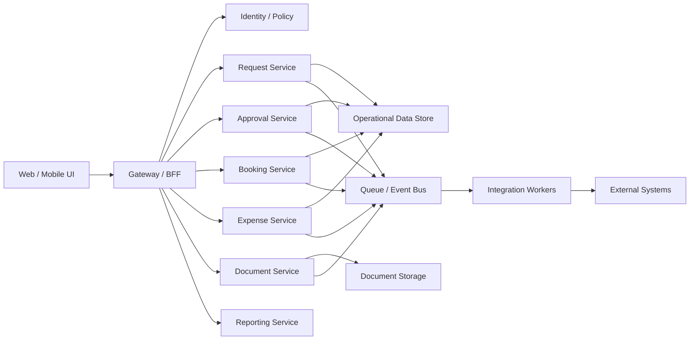

# TMS Internal Flaws And Future-State Reimagination

## Codebase-Grounded Flaws

### 1. Security posture is critically weak

Grounded findings from the repo:

- `TravelAPI/TravelAPI/appsettings.Development.json` contains database credentials, client secrets, JWT secrets, report server passwords, API keys, and cloud credentials
- frontend `.env` files are committed
- some API endpoints expose integration configuration that should never be returned to clients

Impact:

- credential compromise risk
- environment compromise risk
- unsafe developer and CI distribution of secrets

### 2. The backend is an overloaded monolith

Grounded findings from the repo:

- `Program.cs` registers one API host plus multiple background services
- controller inventory spans requests, approvals, booking, expenses, reports, configurations, mobile, and AI assist
- hosted services handle approvals, wallet integration, email receipts, Outlook events, Everbridge, exception reporting, and journal import

Impact:

- difficult releases
- coupled failure domains
- poor scalability by business function

### 3. Business logic is split across too many layers

Grounded findings from the repo:

- controllers directly instantiate model/data model classes
- raw `SqlConnection` is used broadly
- many flows are driven by stored procedures and string-based actions
- `ViewName` and `Operation` parameters act like hidden workflow selectors

Impact:

- low traceability of behavior
- weak testability
- high onboarding cost

### 4. Frontend workflow control is fragile

Grounded findings from the repo:

- `App.js` manages auth refresh and logout behavior directly in the shell
- `LandingPage.js` and other screens branch on role IDs like `189`, `190`, and `191`
- `ParentFetch.js` is loosely typed and minimal
- session storage is the dominant app-state carrier

Impact:

- hard-to-change authorization behavior
- poor UI consistency across roles
- high risk of hidden client-state bugs

### 5. Infrastructure concerns leak into business logic

Grounded findings from the repo:

- file-share access and Windows impersonation appear in request-handling code
- OCR, PDF, file generation, and receipt extraction are mixed into business controllers
- background services open and retain many SQL connections

Impact:

- brittle runtime behavior
- hard incident isolation
- difficult local and test environments

### 6. Engineering hygiene is inconsistent

Grounded findings from the repo:

- `Travel/README.md` is still template text
- generated coverage artifacts are committed
- Azure pipeline content appears stale and partially copied from unrelated examples
- test coverage is present but small compared to workflow breadth

Impact:

- poor onboarding
- weak confidence in change safety
- maintenance burden compounds over time

## Future-State Reimagination

## 1. Reframe TMS as a workflow platform

The future system should be treated as a workflow and operations platform with travel as one domain, not as a single booking application.

Core domains should be explicit:

- identity and access
- travel requests
- approvals
- booking and itineraries
- expenses and reimbursements
- documents and receipts
- reporting and analytics
- integrations

## 2. Separate user workflow from integration orchestration

The current API host does too much. The reimagined system should split:

- synchronous user-facing APIs
- asynchronous worker-driven integrations
- document/OCR processing
- reporting/export pipelines

This allows booking sync, Everbridge updates, journal imports, Outlook events, and receipt extraction to run independently from the core request/expense experience.

## 3. Replace magic workflow selectors with explicit domain models

Current flows depend on:

- role ID numbers
- `ViewName` strings
- `Operation` strings

Future state should define:

- typed workflow states
- typed commands and queries
- auditable domain events
- clear ownership of each state transition

Examples:

- `TravelRequestSubmitted`
- `ApprovalAssigned`
- `BookingStarted`
- `ExpenseReportSubmitted`
- `SettlementCompleted`

## 4. Harden security before feature expansion

Immediate redesign principles:

- no secrets in source control
- secret storage only in managed vault systems
- server-side authorization policies by permission, not role-number checks in UI code
- no raw integration credential exposure through APIs

## 5. Rebuild the frontend around domain modules

Instead of route-heavy feature sprawl, the UI should be reorganized into domain-oriented modules:

- requests
- approvals
- booking
- expenses
- reporting
- admin/configuration

Each module should own:

- typed API contracts
- role-aware page composition
- local state and validation
- reusable status/timeline components

## 6. Introduce a clearer operational model

The current process appears to fragment ownership across requesters, approvers, vendors, finance, and admins. The redesign should provide:

- a unified request timeline
- a clear current owner for every request/report
- explicit SLA and escalation states
- queue-based dashboards by responsibility

## 7. Suggested target topology

## 8. Migration path

### Phase 1

- rotate secrets
- remove secret material from source
- document current workflows and top stored procedures
- define canonical domain boundaries

### Phase 2

- isolate integrations behind adapters
- move hosted services into workers
- introduce typed API contracts
- wrap raw SQL behind domain services/repositories

### Phase 3

- rebuild request and approval flows first
- then booking orchestration
- then expense and reimbursement lifecycle
- then receipt/document processing
- then reporting modernization

## 9. Success criteria

The reimagined process is successful if:

- workflow states are understandable without reading controller code
- secrets are fully removed from the repo and client payloads
- integrations fail independently and recover safely
- onboarding time drops substantially
- new workflow changes affect one domain at a time instead of the whole monolith
